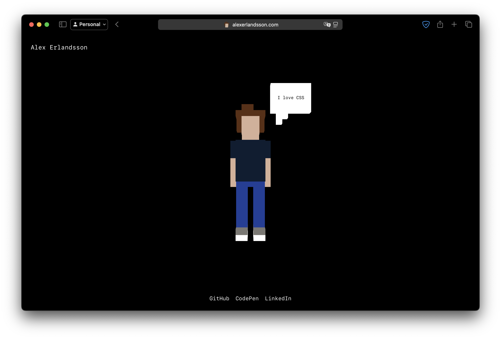

# Alex Erlandsson

This is the repository for my personal website https://alexerlandsson.com hosted with _GitHub Pages_.



## Work in this repository

This is a very simple website that is built using vanilla HTML, CSS and JavaScript. It is a static site with no backend or server-side code. No build tools, no frameworks and no libraries are used.

### Code formatting

This project uses [Prettier](https://prettier.io/) to format the code. You can run it using the following command:

```bash
npm run format
```

### CSS linting

This project uses [stylelint](https://stylelint.io/) to lint the CSS. You can run it using the following command:

```bash
npm run lint:css
```

### GitHub Pages

This project is hosted using _GitHub Pages_ and being built from the `/docs` folder in the `master` branch. There are no CI/CD jobs building the project since everything is built using vanilla HTML, CSS and JavaScript.
